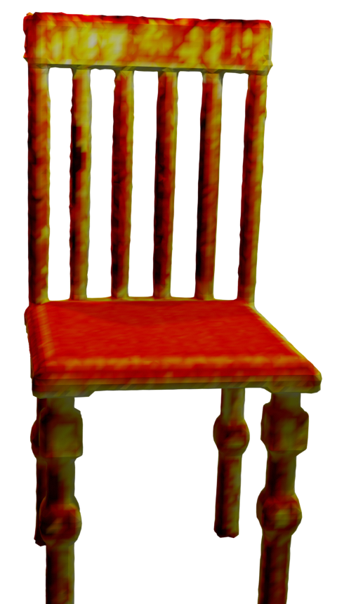
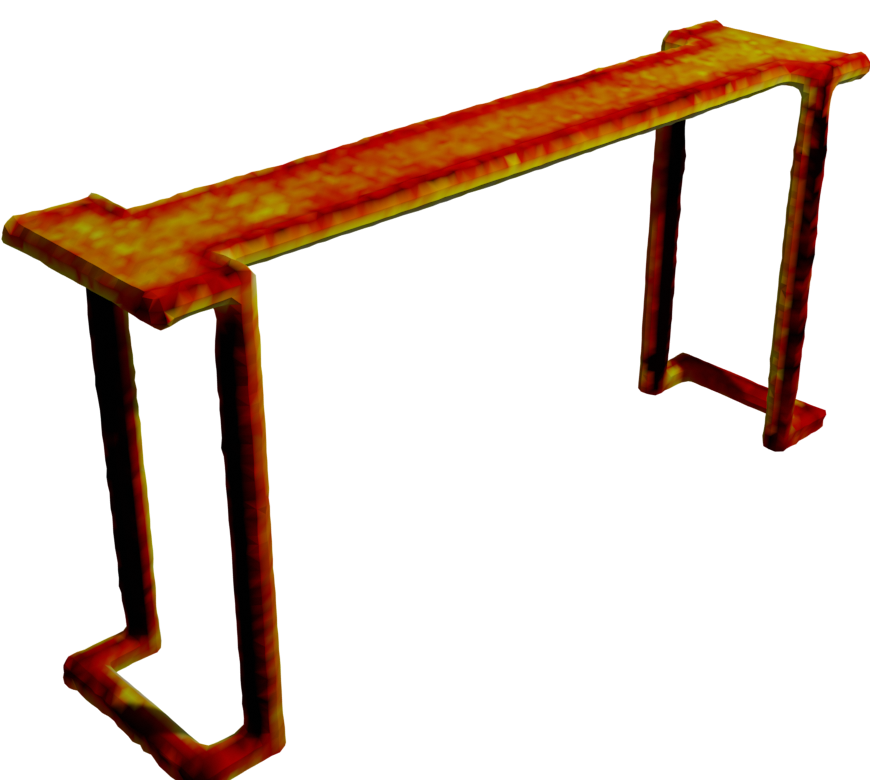



### Method
In this work, we propose a novel depth fusion pipeline that leverages a learned latent space to integrate noisy and outlier contaminated depth measurements.

<figure>
</img>
<figcaption style="text-align: left"><b>Overview about the proposed fusion pipeline.</b> The proposed pipeline consists of four stages. The first three stage integrate new measurements into the latent scene representation while the last stage translates the features to TSDF values.</figcaption>
</figure>

#### Pipeline Overview
The proposed pipeline consists of four stages. Firstly, we extract the current state of the global scene representation into a local, view-aligned feature volume using the new depth measurement together with its camera parameters.
This local feature volume is concatenated with the new depth map and passed through the fusion network.
The fusion networks predicts feature updates in the local feature volume. 
These feature updates are integrated back into the global scene representation using the integration layer.
As the scene representation is not interpretable, we propose the usage of a translator network that translates the features into human-readable output such as TSDF values. 
From the translated TSDF grid, the mesh can be extracted using marching cubes.

#### Motivation for Latent Scene Representation
We motivate the usage of a learned latent scene representation with the observation that it is hard for a neural network in a fusion pipeline to distinguish between an outlier and a first measurement of a new geometry.
Therefore, do not use a learned filter in the fusion step to avoid unnecessary filtering and integrate all measurements into the learned scene representation. 
Instead, we let the translation network make the decision about outliers, noise, or true geometry from aggregated measurements in the latent feature space. 
As we can show in our experiments, this leads to more complete yet cleaner reconstructions. 

### Results

We evaluate our method on synthetic ShapeNet and ModelNet data as well as real-world time-of-flight and multi-view stereo data. We compare our method to existing depth fusion as well as scene representation methods.

#### Evaluation on ShapeNet

First, we evaluate our method on fusing noisy depth maps rendered from ShapeNet shapes and compare it to other baselines. We compare it not only to existing fusion methods but also to recent implicit scene representation methods. 
We can show that our method improves the accuracy of the reconstructed meshes, when fusing noisy depth maps. 

<table align='center'>
<tr>
<td></td>
<td></td>
<td></td>
<td></td>
<td></td>
</tr>
<tr>
<td></td>
<td></td>
<td></td>
<td></td>
<td></td>
</tr>
<tr>
<td></td>
<td></td>
<td></td>
<td></td>
<td></td>
</tr>
<td>
<small>Park et al. 2019</small>
</td>
<td>
<small>Chibane et al. 2020</small>
</td>
<td>
<small>Curless et al. 1996</small>
</td>
<td>
<small>Weder et al. 2020</small>
</td>
<td>
<small><b>Ours</b></small>
</td>
</tr>
<caption><b>Qualitative results on ShapeNet.</b> We improve the reconstruction quality from noisy depth maps rendered from ShapeNet shapes compared to existing scene representations and fusion methods</caption>
</table>

We also investigate the accuracy of the reconstructed meshes using different fusion methods. In the table below, we visualize the meshes color-coded using the mesh accuracy of the different methods.

<table align='center'>
<tr>
<td>
<small>Curless et al. 1996</small>
</td>
<td></td>
<td></td>
<td></td>
<td></td>
<td></td>
</tr>
<tr>
<td>
<small>Weder et al. 2020</small>
</td>
<td></td>
<td></td>
<td></td>
<td></td>
<td></td>
</tr>
<tr>
<td>
<small><b>Ours</b></small>
</td>
<td></td>
<td></td>
<td></td>
<td></td>
<td></td>
</tr>
<caption><b>Visualizing the error on ShapeNet meshes.</b>  We reconstruct the objects with higher accuracy then existing fusion methods.</caption>
</table>

We show that our method reconstructs the meshes with higher accuracy as wells as further mitigate thickening artefacts that corrupt the result in TSDF Fusion and RoutedFusion.

#### Evaluating Outlier Filtering on ModelNet
Further, as learned end-to-end outlier filtering is one of the main goals of our pipeline, we evaluate the pipeline's outlier filtering capabilities. 
Therefore, we contaminated depth maps rendered from ModelNet shapes with different amounts of outliers. We add 1%, 5%, and 10% of outliers.
We can show in the table below that our method filters almost all outliers from the scene, while TSDF Fusion as well as RoutedFusion have troubles in reconstructing clean, outlier-free meshes.

<table align='center'>
<tr>
<td>
<small>0.01</small>
</td>
<td></td>
<td></td>
<td></td>
</tr>
<tr>
<td>
<small>0.05</small>
</td>
<td></td>
<td></td>
<td></td>
</tr>
<tr>
<td>
<small><b>0.1</b></small>
</td>
<td></td>
<td></td>
<td></td>
</tr>
<tr>
<td>
<small>Outlier Fraction</small>
</td>
<td>
<small>Curless et al. 1996</small>
</td>
<td>
<small>Weder et al. 2020</small>
</td>
<td>
<small>Ours</small>
</td>
</tr>
<caption><b>Filtering outliers from ModelNet reconstructions.</b> We significantly improve the outlier filtering capability with our learned end-to-end fusion pipeline.</caption>
</table>

### Real-World Results
We also evaluate our method on real-world data obtained from multi-view stereo methods and time-of-flight sensors. 

#### Multi-view Stereo Data
Firstly, we compare the fusion performance of our method compared to existing methods on depth maps reconstructed with COLMAP. 
These depth maps are usually heavily contaminated with outliers. Therefore, a powerful outlier handling is crucial to obtain clean 3D reconstructions.
We demonstrate this by fusing the depth maps using TSDF Fusion, RoutedFusion with its outlier filter heuristic, and our method that filters the outliers in a learned end-to-end fashion.

<table align='center'>
<tr>
<td></td>
<td></td>
<td></td>
<td></td>
<td></td>
</tr>
<td></td>
<td></td>
<td></td>
<td></td>
<td></td>
</tr>
<td></td>
<td></td>
<td></td>
<td></td>
<td></td>
</tr>
<tr>
<td></td>
<td>
<small>PSR</small>
</td>
<td>
<small>Curless et al. 1996</small>
</td>
<td>
<small>Weder et al. 2020</small>
</td>
<td>
<small>Ours</small>
</td>
</tr>
<caption><b>Reconstructing Tanks and Temples scenes from multi-view stereo depth maps.</b> We reconstruct significantly cleaner meshes from MVS depth maps heavily contaminated with outliers compared to existing fusion methods.</caption>
</table>

In the figure above, we can clearly show that our proposed end-to-end pipeline fusing the measurements into a learned latent space is superior in reconstructing clean meshes compared to the existing fusion and meshing methods.

#### Time-of-flight Data
Secondly, we fuse time-of-flight data taken from the Scene3D dataset. We also compare our method to the two other baselines. We can not only show that our method improves the accuracy but also would like to highlight the increased completeness due to our learned translation opposed to the handcrafted outlier filtering heuristics used in the other methods.

<table align="center">
<tr>
<td></td>
<td></td>
<td></td>
<td></td>
</tr>
<tr>
<td></td>
<td></td>
<td></td>
<td></td>
</tr>
<tr>
<td></td>
<td>
<small>Curless et al. 1996</small>
</td>
<td>
<small>Weder et al. 2020</small>
</td>
<td>
<small>Ours</small>
</td>
</tr>
<caption><b>Fusing time-of-flight data from Scene3D.</b> Our learned translation improves the completeness compared to the handcrafted heuristics used in existing methods.</caption>
</table>

#### Iterative Fusion
Finally, we would like to show the iterative fusion results of our pipeline in the animation below. You can see the iterative reconstruction of a Tanks and Temples scene.

### Conclusion
We have presented a novel depth fusion pipeline that leverages a learned latent scene representation and can be trained in an end-to-end way. 
The latent scene representation is efficiently translated into human-readable output (TSDF values) to allow mesh extraction using the marching cubes algorithm. 
This translation allows to effectively filter outliers and denoise the reconstruction while improving the completeness of the mesh. 
Together with the powerful scene representation, the pipeline outperforms existing methods in reconstructing scenes from noisy and outlier contaminated depth maps. 
