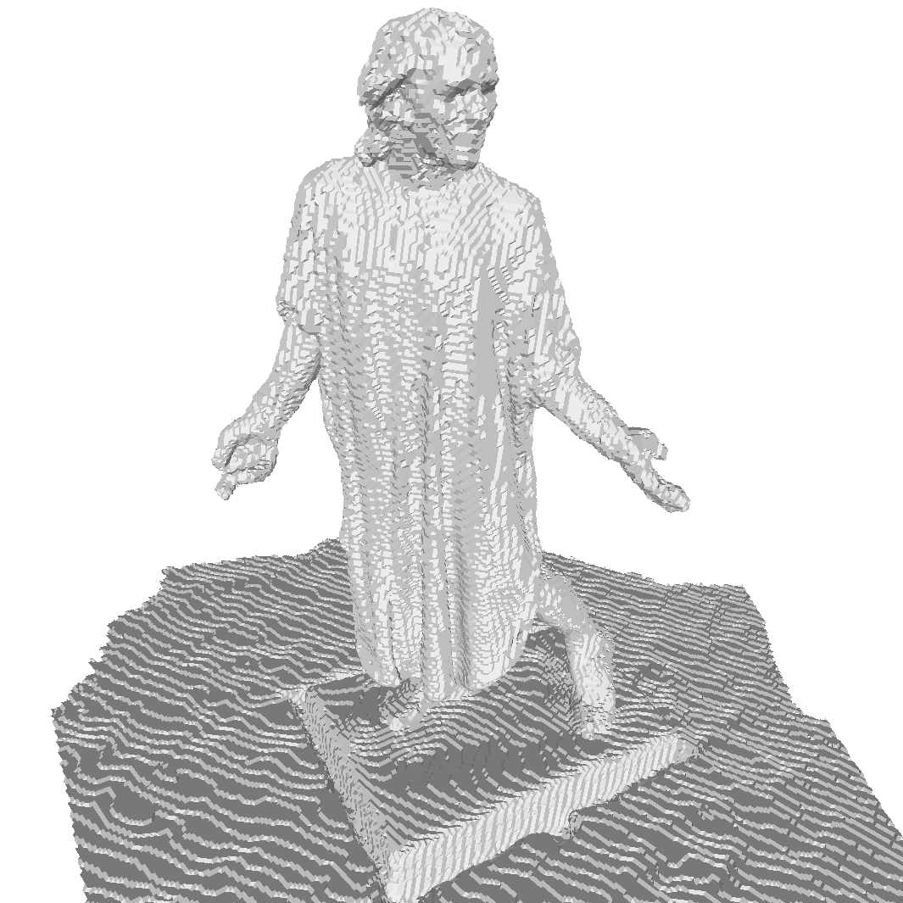



### Method

Our method consists of four key stages. Firstly, the depth routing network estimates a corrected depth map and a confidence map from a noisy and outlier contaminated depth map. The corrected depth map guides the extraction of a canonical TSDF volume from the global TSDF volume. The canonical volume is passed together with the corrected depth map and the confidence map through the depth fusion network. This depth fusion network predicts optimal updates for the local canonical TSDF volume given its old state and the new measurement. Finally, the updated canonical TSDF volume is integrated back into the global TSDF volume.

<table align='center'>
<tr>
<td></td>
</tr>
<caption><b>Overview of the RoutedFusion pipeline.</b> It consists of four stages that refine and integrate new sensor measurements into the existing scene.</caption>
</table>

### Results

We evaluate our method on synthetic as well as real-world data. We compare the results to several existing state-of-the-art and baseline methods.

#### Synthetic Data
In order to compare our method to existing learning-based as well as handcrafted method, we evaluate the performance in fusing synthetic depth maps from the ShapeNet dataset that is augmented with an artificial depth-dependent noise distribution.

<table align='center'>
<tr>
<td></td>
<td></td>
<td></td>
<td></td>
<td></td>
</tr>
<tr>
<td></td>
<td></td>
<td></td>
<td></td>
<td></td>
</tr>
<tr>
<td></td>
<td></td>
<td></td>
<td></td>
<td></td>
</tr>
<tr>
<td></td>
<td></td>
<td></td>
<td></td>
<td></td>
</tr>
<tr>
<td>
<small>Park et al. 2019</small>
</td>
<td>
<small>Mescheder et al. 2019</small>
</td>
<td>
<small>Curless et al. 1996</small>
</td>
<td>
<small><b>Ours</b></small>
</td>
<td>
<small>Ground-truth</small>
</td>
</tr>
<caption><b>Qualitative results on ShapeNet.</b> We significantly better reconstruct fine details than existing methods. Furthermore, RoutedFusion does not show any overfitting to the training data due to its compact neural networks.</caption>
</table>

We quantitatively and qualitatively show that our method outperforms existing depth fusion and 3D representation methods. Especially, our method generalizes significantly better to unseen shapes than existing learning-based methods.

<table align='center'">
<tr>
<th>Method</th>
<th>MSE [e-05]</th>
<th>MAD</th>
<th>Acc. [%]</th>
<th>IoU. [0, 1]</th>
</tr>
<tr>
<td><left>Park et al. 2019</left></td>
<td><right>464.00</right></td>
<td><right>0.0499</right></td>
<td><right>66.48</right></td>
<td><right>0.538</right></td>
</tr>
<td><left>Mescheder et al. 2019</left></td>
<td><right>56.80</right></td>
<td><right>0.0166</right></td>
<td><right>85.66</right></td>
<td><right>0.484</right></td>
</tr>
<td><left>Curless et al. 1996</left></td>
<td><right>11.00</right></td>
<td><right>0.0078</right></td>
<td><right>88.06</right></td>
<td><right>0.659</right></td>
</tr>
<td><left>Ours</left></td>
<td><right><b>5.90</b></right></td>
<td><right><b>0.0050</b></right></td>
<td><right><b>94.77</b></right></td>
<td><right><b>0.785</b></right></td>
</tr>
<caption><b>Quantitative results on ShapeNet.</b> We outperform existing learning-based and handcrafted methods in fusing depth maps augmented with an artificial depth-dependent noise distribution.</caption>
</table>

We also investigate the robustness of our method to higher input noise levels. Therefore, we augment the input depth maps with different noise levels and fuse them using standard TSDF Fusion as well as our RoutedFusion.

<table align='center'>
<tr>
<td><small>
Curless et al. 1996
</small></td>
<td></td>
<td></td>
<td></td>
</tr>
<tr>
<td><small>
Ours
</small></td>
<td></td>
<td></td>
<td></td>
</tr>
<tr>
<td>
<small>Input Noise Level</small>
</td>
<td>
<small>0.01</small>
</td>
<td>
<small>0.03</small>
</td>
<td>
<small>0.05</small>
</td>
</tr>

<caption><b>Comparison to Standard TSDF Fusion in fusing noisy depth maps.</b> We increase the input noise level in order to demonstrate the robustness of our method to high noise levels. </caption>
</table>

#### Real-World Data

We also run our pipeline on real-world data. We evaluate our pipeline on the Scene3D dataset. We show that our method compares favourably to existing depth fusion methods.

<table align='center'>
<tr>
<td></td>
<td></td>
<td></td>
</tr>
<tr>
<td></td>
<td></td>
<td></td>
</tr>
<tr>
<td><small>
Curless et al. 1996
</small></td>
<td><small>
Dong et al. 2018
</small></td>
<td><small>
Ours
</small></td>
</tr>
<caption><b>Comparison on the Burghers of Calais scene.</b> We favourably compare to existing online depth map fusion methods. Especially, the reconstruction of fine details is significantly improved.</caption>
</table>

### Conclusion

With RoutedFusion, we propose a real-time, learning-based depth map fusion method. This method allows for better fusion of imperfect depth maps and reconstruction of 3D geometry from range imagery in real-world applications. Although only very little training data is required to train RoutedFusion, we show that compact neural networks can be effectively used for real-world applications without the risk of overfitting. This allows for easy transfer to new sensors and scenarios, where only little training data is available.
